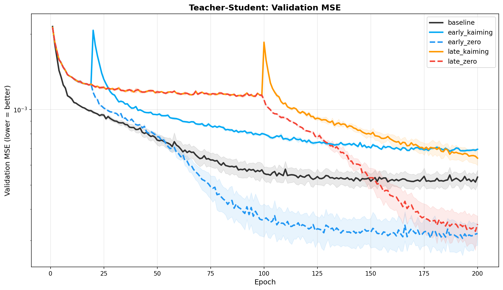
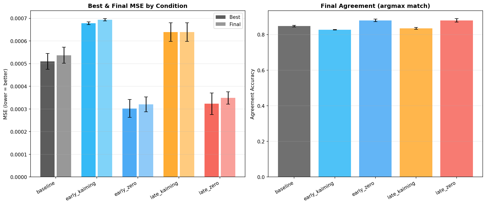
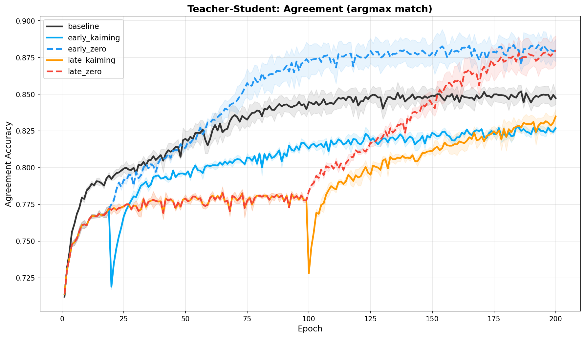
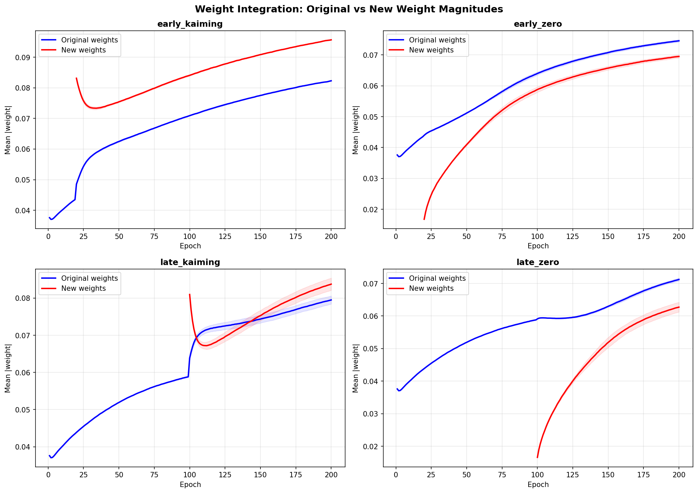
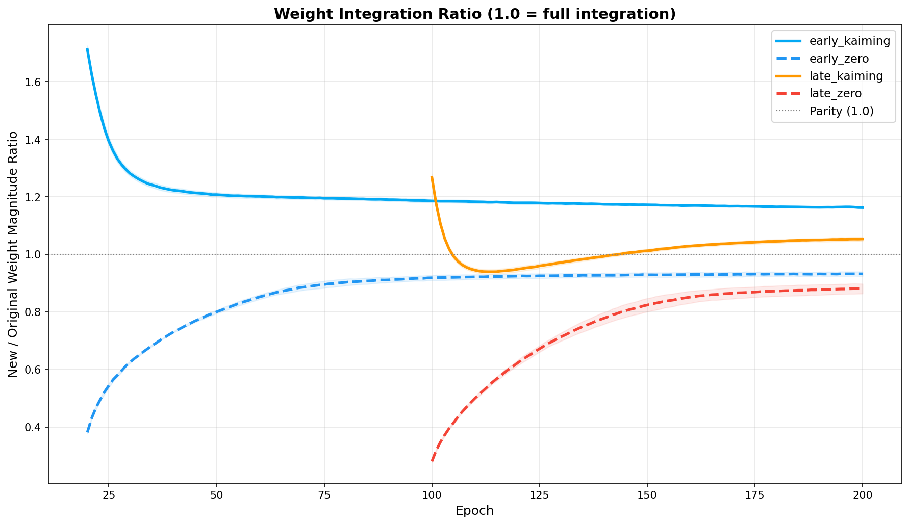
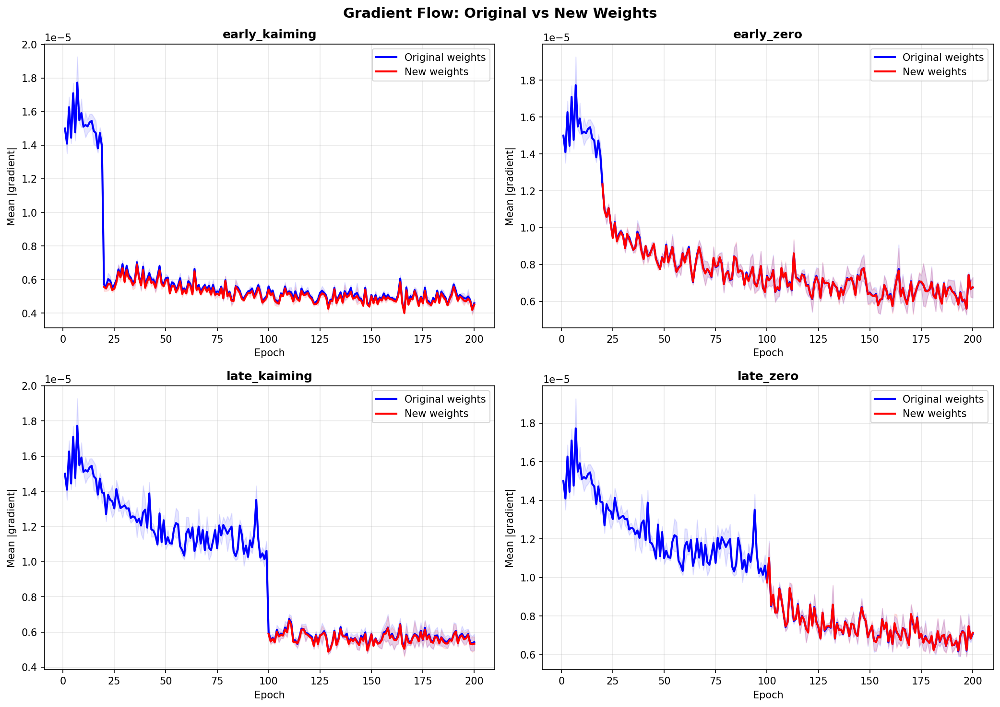
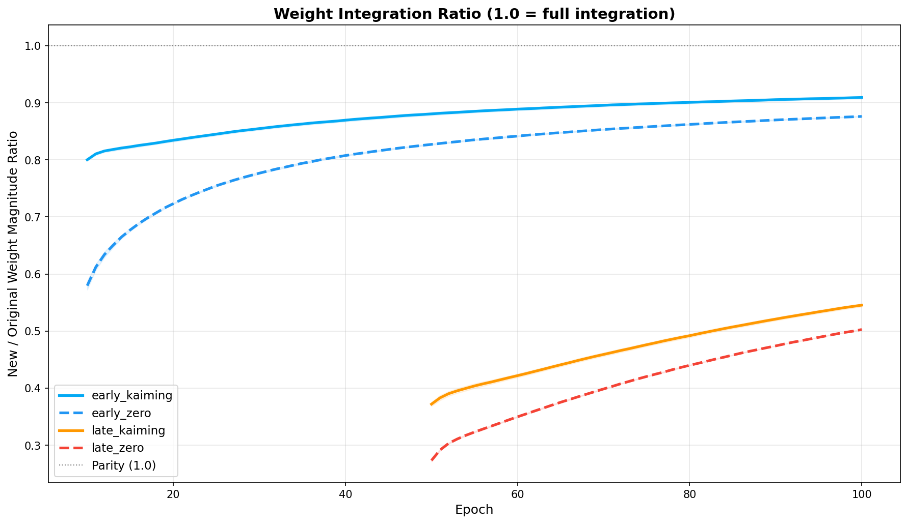

# Do Neural Networks Have Critical Periods for Structural Change?

Experiments investigating whether neural networks resist incorporating new weights after early training — a "critical period" for structural plasticity — and whether initialization method matters more than timing.

## The Question

When you add new weights to a partially-trained network, do they integrate into the learned computation? The answer depends on *when* you add them and *how* you initialize them — but not in the way you'd expect.

## Phase 4: Teacher-Student (The Clean Experiment)

Phase 3 (below) was confounded by overfitting. Phase 4 fixes this with a synthetic teacher-student task where capacity is provably the bottleneck.

### Setup

- **Teacher**: Random frozen MLP (100 → 256 → 128 → 10), fixed weights
- **Student**: Same architecture with masked weights (`MaskedMLP`, `oversized_factor=1.0`)
- **Data**: 50k fresh random N(0,1) inputs per epoch (infinite data = zero overfitting), 10k fixed validation set
- **Metric**: MSE to teacher's outputs (regression, not classification)
- At 60% capacity, the student provably cannot represent the teacher's function. At 100%, it can.

Same 2x2 design: (early/late) × (zero/kaiming) + baseline, 200 epochs, 3 seeds.

### Results: Init method dominates; no critical period





| Condition | Best MSE | Final Agreement | Integration Ratio @ 200 |
|---|---|---|---|
| **early_zero** | **0.000302 ± 0.000039** | **0.880** | 0.93 |
| **late_zero** | **0.000323 ± 0.000048** | **0.880** | 0.90 |
| baseline | 0.000510 ± 0.000035 | 0.847 | — |
| late_kaiming | 0.000639 ± 0.000041 | 0.835 | 1.05 |
| early_kaiming | 0.000678 ± 0.000006 | 0.827 | 1.17 |

**The big surprise: zero-init expansion beats everything, including baseline.**

- `early_zero` achieves 41% lower MSE than baseline (0.000302 vs 0.000510)
- `late_zero` achieves 37% lower MSE than baseline (0.000323 vs 0.000510)
- Kaiming init is *worse* than baseline — it disrupts the learned computation
- **Timing barely matters**: early_zero ≈ late_zero, early_kaiming ≈ late_kaiming

### No critical period — init method is everything



The 2x2 design was supposed to separate timing from initialization. It did — and timing lost. There is no critical period effect. The dominant factor is whether new weights preserve or disrupt the existing computation:

- **Zero init = preserve**: New weights start at zero, meaning the network's function is unchanged at expansion. The new weights then gradually learn to correct residual errors, building on the existing representation. This acts like progressive learning.
- **Kaiming init = disrupt**: Random initialization injects noise proportional to layer width. MSE immediately *jumps up* at expansion (+0.0007-0.0008), and the network never fully recovers.

### Why zero-init beats baseline

This is the most surprising finding. Starting with 60% capacity and zero-expanding to 100% *outperforms* having all weights from the start. The mechanism:

1. The 60%-capacity phase forces the network to learn a compact, efficient core representation
2. Zero-initialized new weights don't disrupt this core — they start as identity-like additions
3. The new weights then learn complementary features that correct residual errors
4. This progressive structure acts as implicit regularization — similar to progressive growing in GANs or curriculum learning

The baseline, with all weights competing from epoch 1, never develops this structured decomposition into "core" and "correction" components.

### Weight integration





Zero-init weights gradually grow to ~90-93% of original weight magnitude. Kaiming-init weights *start* at ~1.3-1.7x original magnitude (they're too big!) and slowly converge toward 1.0x but always remain above parity — they dominate the computation rather than complementing it.

### Gradient flow



Both init methods receive comparable gradients. The difference is entirely about the starting point and its interaction with the learned loss landscape.

## Phase 3: Critical Period on CIFAR-10 (Confounded)

### Design

3-layer MLP with 1.5x oversized hidden dims (3072 → 1536/768/384 → 10), CIFAR-10, 100 epochs.

| | Zero Init | Kaiming Init |
|---|---|---|
| **Early** (epoch 10) | Start 60%, expand at epoch 10. New = 0. | New ~ N(0, sqrt(2/fan_in)). |
| **Late** (epoch 50) | Start 60%, expand at epoch 50. New = 0. | New ~ N(0, sqrt(2/fan_in)). |

Plus baseline (100% from start).

### Results



Weight integration showed a clear timing effect: early weights reached 87-91% of original magnitude, late weights only 50-55%.

**But performance was indistinguishable** — all conditions converged to ~56-57% with a 36% generalization gap. The MLP architecture caps out at ~57% on CIFAR-10 regardless of parameter count. At 60% capacity the network is already overparameterized for what the architecture can learn.

This is why Phase 4 uses a teacher-student task where capacity is the actual bottleneck.

## Earlier Phases

### Phase 1: Observing Natural Sparsity

Standard training with Adam in float32 produces zero exact zeros. Near-zero weights (|w| < 1e-3) are 1-2% of total and *decrease* during training.

### Phase 2: Capacity Growth Schedules

Five conditions (60-100% initial active fraction) with linear growth to 100% by epoch 75. No significant performance differences — same overfitting confound as Phase 3.

## Usage

### Requirements

```
torch
torchvision
matplotlib
numpy
```

### Running the teacher-student experiment (Phase 4)

```bash
# Full experiment (5 conditions x 3 seeds x 200 epochs, ~10 min on GPU)
python3 teacher_student.py --epochs 200 --seeds 3

# Single condition
python3 teacher_student.py --conditions late_zero --seeds 1

# Generate plots
python3 analyze.py --phase 4 --input_dir results/phase4_teacher_student
```

### Running the CIFAR-10 experiment (Phase 3)

```bash
python3 critical_period.py --dataset cifar10 --epochs 100 --seeds 3
python3 analyze.py --phase 3 --input_dir results/phase3_cifar10
```

## File Structure

```
models.py            # MaskedLinear, MaskedMLP — masked weight layers with integration tracking
utils.py             # SparsityTracker — recording weight/gradient statistics over training
observe.py           # Phase 1: natural sparsity observation
maintain.py          # Phase 2: capacity growth schedules
critical_period.py   # Phase 3: 2x2 critical period experiment (CIFAR-10)
teacher_student.py   # Phase 4: 2x2 critical period experiment (teacher-student)
analyze.py           # Plotting and analysis for all phases
```

## Related Work

- Frankle et al., "The Lottery Ticket Hypothesis" (2019) — sparse subnetworks can train to full accuracy
- Frankle et al., "Stabilizing the Lottery Ticket Hypothesis" (2019) — weight rewinding to early training
- Achille et al., "Critical Learning Periods in Deep Networks" (2019) — information-theoretic view of critical periods
- Our results add a new angle: the "critical period" effect in weight integration (Phase 3) disappears when you control for overfitting (Phase 4). What remains is an init-method effect where zero init acts as implicit progressive regularization.
