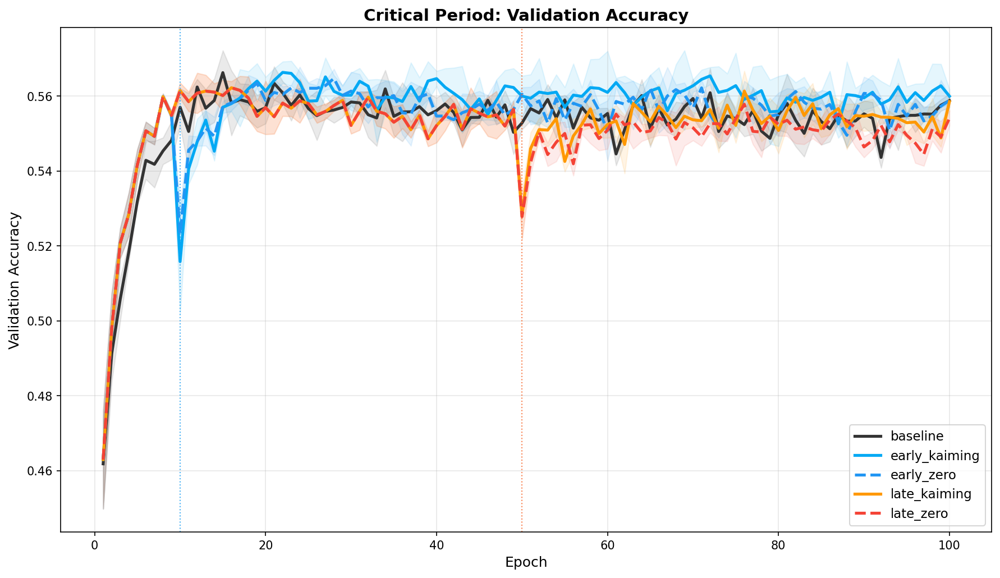
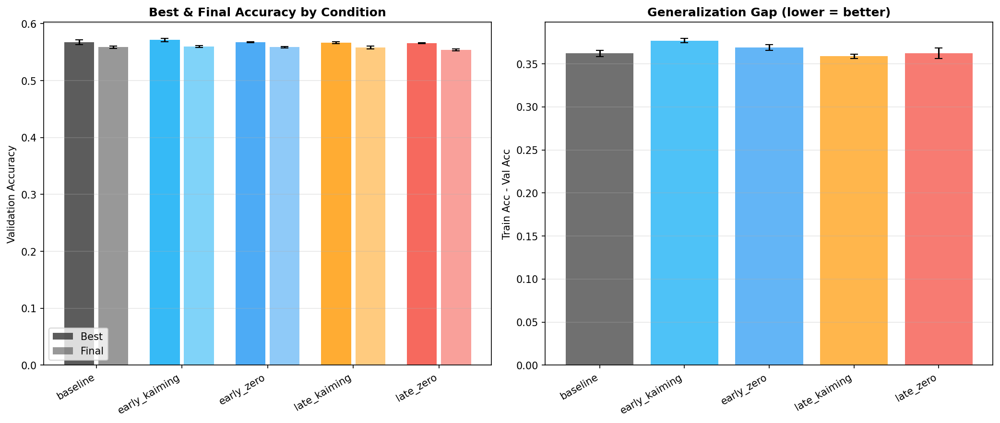
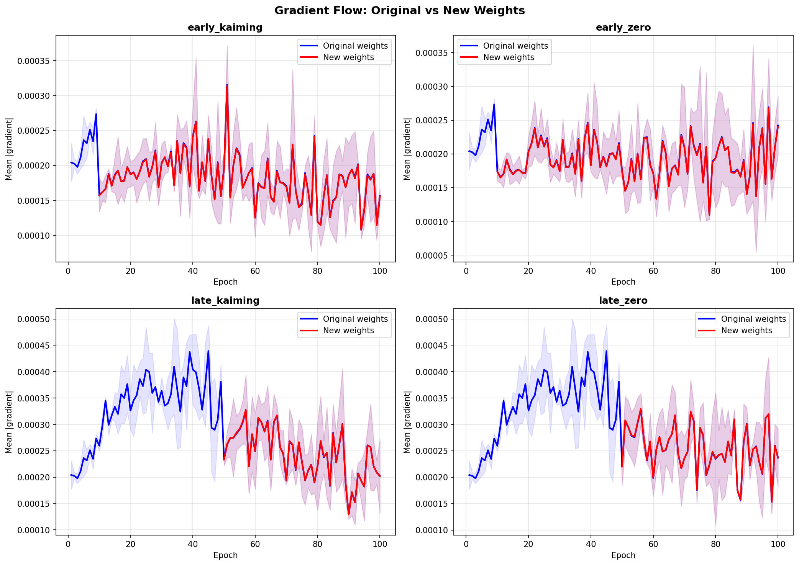

# Do Neural Networks Have Critical Periods for Structural Change?

Experiments investigating whether neural networks resist incorporating new weights after early training — a "critical period" for structural plasticity — or whether poor integration of late-arriving weights is simply an artifact of zero initialization.

## The Question

When you add new weights to a partially-trained network, do they integrate into the learned computation? The answer depends on *when* you add them:

- **Early in training** (epoch 10/100): new weights reach **87-91%** of original weight magnitude
- **Late in training** (epoch 50/100): new weights reach only **50-55%**, regardless of how they're initialized

This gap is the central finding. But does it matter for what the network actually learns?

## Experimental Design

### Phase 3: The Critical Period Experiment (2x2 Factorial)

All conditions use the same architecture: a 3-layer MLP with 1.5x oversized hidden dimensions (3072 → 1536/768/384 → 10), trained on CIFAR-10 for 100 epochs with Adam (lr=1e-3).

| | Zero Init | Kaiming Init |
|---|---|---|
| **Early** (epoch 10) | Start 60% active, expand to 100% at epoch 10. New weights = 0. | Same, but new weights ~ N(0, sqrt(2/fan_in)). |
| **Late** (epoch 50) | Start 60% active, expand to 100% at epoch 50. New weights = 0. | Same, but new weights ~ N(0, sqrt(2/fan_in)). |

Plus a **baseline**: 100% active from epoch 0.

The 2x2 design cleanly separates two hypotheses:
- If late+Kaiming integrates fine but late+zero doesn't → it's just bad initialization (boring)
- If late+Kaiming ALSO fails to integrate → real critical period (interesting)

### Tracking

For each condition, we separately track **original** vs **newly-activated** weights:
- Weight magnitude (mean |w|) over training
- Gradient magnitude (mean |g|) over training
- The **integration ratio**: new weight magnitude / original weight magnitude
- Validation accuracy and generalization gap (train acc - val acc)

## Results

### Weight integration shows a clear timing effect


Early-arriving weights (blue) approach parity with original weights. Late-arriving weights (orange/red) plateau at roughly half the magnitude of originals — and the curve is still rising at epoch 100, suggesting they'd eventually catch up given enough time, but at a fundamentally slower rate.

Kaiming initialization provides a ~4% bonus over zero initialization in both early and late conditions, but **timing dominates init method**.

### Performance is indistinguishable





| Condition | Best Val Acc | Integration Ratio @ 100 |
|---|---|---|
| baseline | 56.8 +/- 0.4% | — |
| early_kaiming | 57.2 +/- 0.3% | 0.91 |
| early_zero | 56.8 +/- 0.1% | 0.88 |
| late_kaiming | 56.7 +/- 0.2% | 0.55 |
| late_zero | 56.6 +/- 0.1% | 0.50 |

All conditions converge to ~56-57% validation accuracy. The 36% generalization gap (92% train, 56% val) shows massive overfitting — the network has far more capacity than it needs, even at 60% active weights.

### Gradient flow to new weights



New weights receive gradients of comparable magnitude to original weights in all conditions. The issue isn't that late weights are gradient-starved — it's that the gradients don't drive them to the same magnitudes. The loss landscape has changed.

## Interpretation

The experiment lands in the ambiguous middle:

**The integration signal is real.** Late weights grow slower, plateau lower, and never catch original weights within the training horizon. This is consistent across all seeds and both init methods. The gradient landscape genuinely treats late-arriving weights differently.

**But it doesn't affect this task.** The network achieves the same accuracy regardless. A simple MLP on CIFAR-10 is already overparameterized at 60% capacity — the extra weights are just overfitting fuel.

**To disambiguate**, you'd need a regime where extra capacity actually helps:
- A harder task or smaller architecture where 60% capacity isn't enough
- Regularization to control overfitting so added capacity could improve generalization
- A different metric — e.g., does the *function* the network computes change when late weights are added?

### Related Work

This connects to Frankle et al.'s work on lottery tickets and critical periods in training ("The Lottery Ticket Hypothesis: Finding Sparse, Trainable Neural Networks," 2019; "Stabilizing the Lottery Ticket Hypothesis," 2019). The weight rewinding results in particular suggest that early training establishes structure that later training refines but doesn't fundamentally alter. Our integration ratio measurements provide direct evidence for this structural rigidity.

## Earlier Phases

### Phase 1: Observing Natural Sparsity

**Finding:** Standard training with Adam in float32 produces zero exact zeros. Near-zero weights (|w| < 1e-3) are 1-2% of total and *decrease* during training as weight magnitudes grow monotonically.

```bash
python3 observe.py --epochs 50 --seeds 5
```

### Phase 2: Capacity Growth Schedules

Tests whether the *trajectory* of capacity utilization matters: does starting with fewer active weights and gradually growing outperform using all weights from the start?

Five conditions (60%, 70%, 80%, 90%, 100% initial active fraction) with linear growth to 100% by epoch 75.

```bash
python3 maintain.py --dataset cifar10 --start_active 0.6 0.7 0.8 0.9 1.0
```

## Usage

### Requirements

```
torch
torchvision
matplotlib
numpy
```

### Running the critical period experiment

```bash
# Full 2x2 experiment (5 conditions x 3 seeds, ~2 hours on GPU)
python3 critical_period.py --dataset cifar10 --epochs 100 --seeds 3

# Single condition
python3 critical_period.py --conditions late_kaiming --seeds 1

# Custom timing
python3 critical_period.py --early_epoch 5 --late_epoch 75
```

### Generating plots

```bash
python3 analyze.py --phase 3 --input_dir results/phase3_cifar10
```

## File Structure

```
models.py            # MaskedLinear, MaskedMLP — masked weight layers with integration tracking
utils.py             # SparsityTracker — recording weight/gradient statistics over training
observe.py           # Phase 1: natural sparsity observation
maintain.py          # Phase 2: capacity growth schedules
critical_period.py   # Phase 3: 2x2 critical period experiment
analyze.py           # Plotting and analysis for all phases
```
